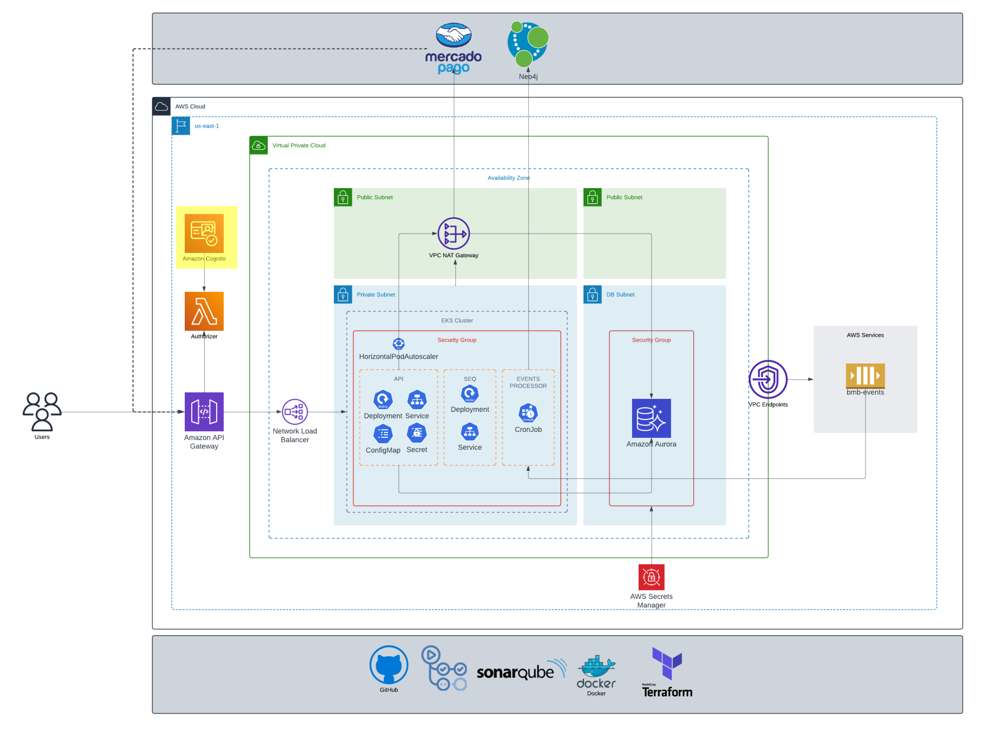

# bmb.users (demo)

# Cognito User Pool Terraform Configuration

This Terraform configuration creates an Amazon Cognito User Pool. Amazon Cognito provides authentication, authorization, and user management for web and mobile apps. Users can sign in directly with a user name and password, or through a third party such as Facebook, Amazon, Google, or Apple.

## This repo on the infrastructure

